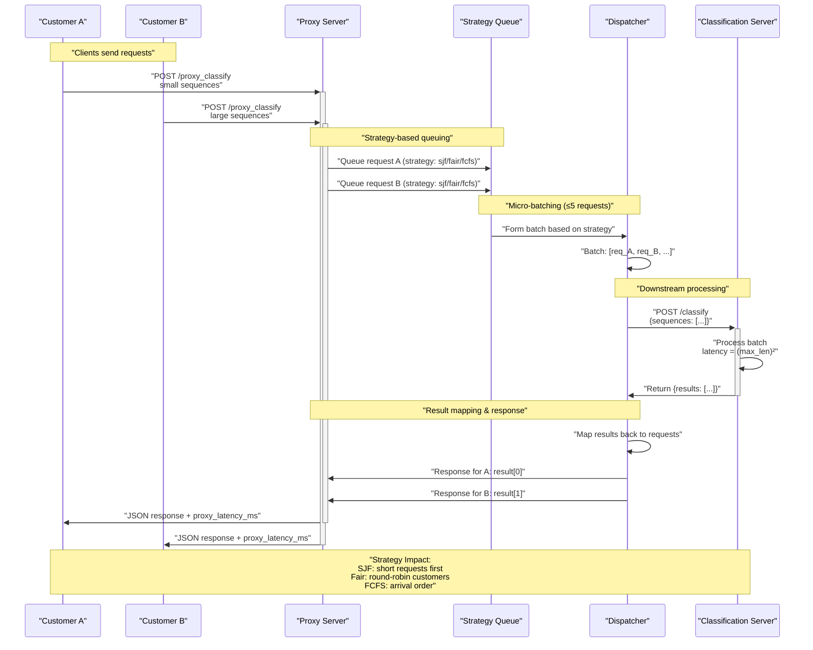

# Smart Batching Proxy Server

## How to run with Anaconda/Conda

```bash
# create and activate conda environment
conda env create -f environment.yaml
conda activate proxy-wars

# start downstream classifier
uvicorn classification_server:app --host 0.0.0.0 --port 8001

# in a 2nd terminal, start proxy (choose strategy: sjf, fair, fcfs)
conda activate proxy-wars
PROXY_STRATEGY=sjf uvicorn proxy:app --host 0.0.0.0 --port 8000

# in a 3rd terminal, run workload generator
conda activate proxy-wars
python simulate_clients.py
```

## Latency Analysis

Run comprehensive latency analysis comparing all strategies:

```bash
# Make sure both servers are running first
# Terminal 1: conda activate proxy-wars && uvicorn classification_server:app --host 0.0.0.0 --port 8001
# Terminal 2: conda activate proxy-wars && uvicorn proxy:app --host 0.0.0.0 --port 8000

# Terminal 3: Run the analysis (tests all strategies automatically)
conda activate proxy-wars
python analyze_latency.py
```

This will:
- Test all 3 strategies (sjf, fair, fcfs) for 30 seconds each
- Automatically switch between strategies
- Collect latency data for both customers
- Generate comparison plots saved to `results/` folder with timestamp
- Create detailed summary statistics

**Output files:**
- `YYYYMMDD_HHMMSS_latency_comparison.png` - 4-panel comparison plot
- `YYYYMMDD_HHMMSS_summary.txt` - Detailed statistics for each strategy

## Testing

Run the comprehensive test suite:

```bash
# Activate conda environment first
conda activate proxy-wars

# Run all tests (unit tests + integration tests if servers are running)
python run_tests.py

# Run only unit tests (no servers required)
python -m pytest tests/test_classification_server.py tests/test_proxy.py::TestProxyBasics -v

# Run integration tests (requires both servers to be running)
python -m pytest tests/test_integration.py -v

# Run specific test file
python -m pytest tests/test_classification_server.py -v
```

### Test Structure
- `tests/test_classification_server.py` - Unit tests for classification server
- `tests/test_proxy.py` - Unit and integration tests for proxy server  
- `tests/test_integration.py` - End-to-end integration tests
- `run_tests.py` - Test runner script

Switch strategies on the fly:

```bash
curl -X POST localhost:8000/strategy -d '"fair"' -H "Content-Type: application/json"
```

---

## Architecture



(Copy the diagram text into any Mermaid-enabled viewer like VS Code, Obsidian, or mermaid.live.)

## Strategies

- **sjf** (Shortest-Job-First): Minimizes average latency by processing shorter sequences first
- **fair** (Round-Robin): Alternates between customers to ensure fairness
- **fcfs** (First-Come-First-Served): Simple FIFO with micro-batching for maximum throughput

---

## Performance Analysis & Strategy Comparison

### Key Findings

Based on comprehensive latency analysis testing all three strategies over 30-second periods each, here are the key findings:

#### Overall Performance Summary

| Strategy | Total Requests | Mean Latency | Median Latency | Std Dev | Min | Max |
|----------|---------------|--------------|---------------|---------|-----|-----|
| **SJF** | 106 | 137.56ms | 18.20ms | 151.15ms | 4.15ms | 332.83ms |
| **Fair** | 100 | 169.01ms | 165.53ms | 155.42ms | 4.63ms | 349.06ms |
| **FCFS** | 96 | 183.51ms | 77.07ms | 131.10ms | 23.65ms | 380.16ms |

### Strategy Deep Dive

#### 1. **SJF (Shortest-Job-First) - WINNER for Overall Performance** ⭐

**Performance:**
- **Best overall latency**: 137.56ms mean, 18.20ms median
- **Highest throughput**: 106 requests in 30 seconds
- **Lowest minimum latency**: 4.15ms

**Customer Impact:**
- **Customer A** (small snippets): 81.56ms mean, 12.15ms median
- **Customer B** (large blocks): 261.44ms mean, 324.08ms median

**Pros:**
- ✅ **Excellent for latency-sensitive workloads** - minimizes average response time
- ✅ **Highest throughput** - processes more requests overall
- ✅ **Great for Customer A** - small requests get priority
- ✅ **Optimal for mixed workloads** - balances efficiency with responsiveness

**Cons:**
- ❌ **Can starve large requests** - Customer B experiences significantly higher latencies
- ❌ **Unfair resource allocation** - biased toward smaller requests
- ❌ **Potential for request starvation** under heavy small-request load

**Best Use Cases:**
- Applications with mixed request sizes where overall latency matters most
- Real-time systems where quick responses are critical
- Scenarios where small requests are more common and business-critical

---

#### 2. **Fair (Round-Robin) - WINNER for Fairness** ⚖️

**Performance:**
- **Moderate latency**: 169.01ms mean, 165.53ms median
- **Balanced throughput**: 100 requests in 30 seconds
- **Consistent behavior**: More predictable response times per customer

**Customer Impact:**
- **Customer A**: 123.38ms mean, 14.28ms median
- **Customer B**: 261.66ms mean, 322.82ms median

**Pros:**
- ✅ **Fairest resource allocation** - ensures both customers get served
- ✅ **Predictable performance** - more consistent latency patterns
- ✅ **Prevents starvation** - guarantees progress for all customers
- ✅ **Good balance** between efficiency and equity

**Cons:**
- ❌ **Slightly higher overall latency** compared to SJF
- ❌ **Not optimal for latency-critical applications**
- ❌ **Can waste efficiency** by not prioritizing short jobs

**Best Use Cases:**
- Multi-tenant applications where fairness is paramount
- SLA-driven environments where all customers need guaranteed service levels
- Systems where preventing any customer from being starved is critical

---

#### 3. **FCFS (First-Come-First-Served) - WINNER for Simplicity** 🎯

**Performance:**
- **Highest latency**: 183.51ms mean, 77.07ms median
- **Lowest throughput**: 96 requests in 30 seconds
- **Highest minimum latency**: 23.65ms (no very fast responses)

**Customer Impact:**
- **Customer A**: 137.56ms mean, 66.12ms median
- **Customer B**: 275.42ms mean, 326.28ms median

**Pros:**
- ✅ **Simplest implementation** - easiest to understand and debug
- ✅ **Predictable ordering** - requests processed in arrival order
- ✅ **No complexity overhead** - minimal computational cost
- ✅ **Fair in terms of arrival time** - first come, first served

**Cons:**
- ❌ **Worst overall performance** - highest mean latency
- ❌ **Lowest throughput** - processes fewer requests
- ❌ **Poor utilization** - doesn't optimize batch composition
- ❌ **Head-of-line blocking** - large requests delay small ones

**Best Use Cases:**
- Simple applications where implementation complexity must be minimized
- Scenarios where arrival order is important for business logic
- Debugging and baseline measurements
- Low-traffic applications where optimization doesn't matter

---

### Recommendations by Use Case

#### **For Production High-Performance Systems → SJF**
- Choose SJF when overall system latency and throughput are the primary concerns
- Best for API gateways, real-time data processing, or user-facing applications
- Monitor Customer B latency and implement safeguards if needed

#### **For Multi-Tenant SaaS Platforms → Fair**
- Choose Fair when customer equity and SLA compliance are critical
- Best for enterprise applications with multiple paying customers
- Provides predictable performance guarantees for all tenants

#### **For Internal Tools or MVPs → FCFS**
- Choose FCFS when simplicity is more important than performance
- Best for internal applications, development environments, or proof-of-concepts
- Easiest to implement, understand, and maintain

#### **Hybrid Approach (Future Enhancement)**
Consider implementing adaptive strategies:
- **SJF with starvation prevention**: Use SJF but promote old requests after a timeout
- **Fair with priority tiers**: Round-robin within customer priority classes
- **Dynamic switching**: Automatically change strategies based on load patterns

### Technical Implementation Notes

1. **Batching Efficiency**: All strategies benefit from the micro-batching approach (≤5 requests per batch)
2. **Customer Identification**: Uses `X-Customer-Id` header with fallback to "default"
3. **Strategy Switching**: Can be changed dynamically via `/strategy` endpoint without service restart
4. **Monitoring**: Each response includes `proxy_latency_ms` for performance tracking

### Testing Coverage

The system includes comprehensive test coverage:
- **22 total tests** passing in ~0.6 seconds
- **Unit tests**: Validate individual component logic without external dependencies
- **Integration tests**: End-to-end testing with both servers (skip gracefully if servers not running)
- **Load testing**: `simulate_clients.py` for realistic workload simulation
- **Performance analysis**: `analyze_latency.py` for detailed strategy comparison 